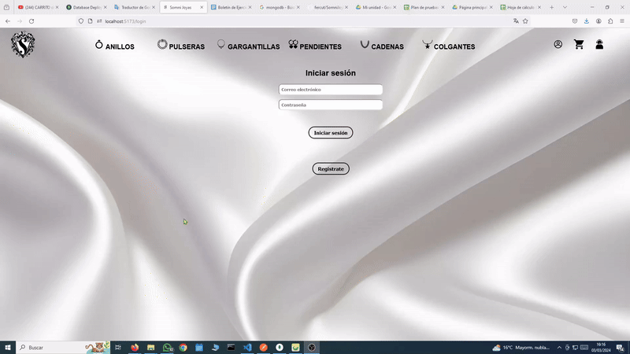
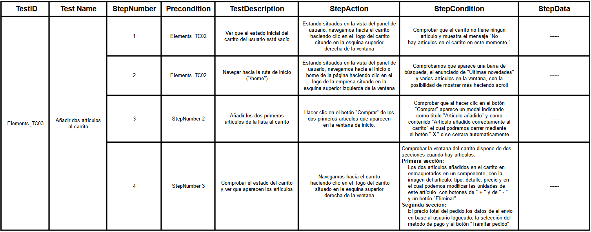
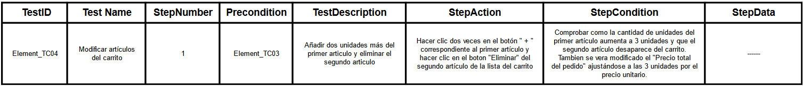
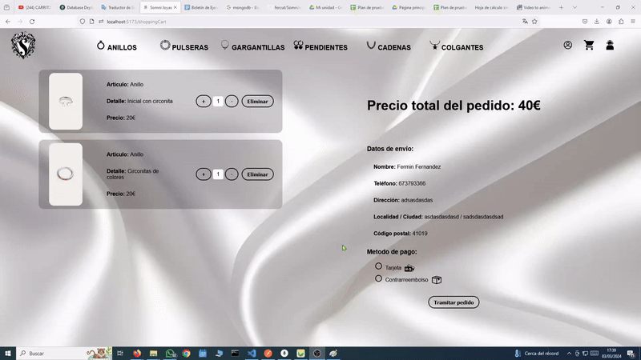
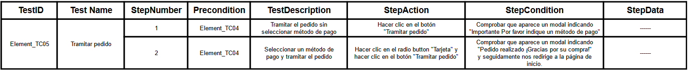
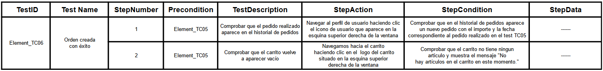

# SomniJoyas 

---
## React  Node MongoDB

  
  
  

 

## :mag: Detalles del proyecto
---

> **BACKEND >** El del backend esta desarrollada con **NodeJS**, esta alojada en el directorio **/server** y desplegada en **Render** en el enlace  https://somniapi.onrender.com y la documentacion **SWAGGER** en https://somniapi.onrender.com/api-docs/ que de forma comoda podemos hacer un CRUD de todas las colecciones de la BBDD.

> **FRONTEND >** El frontend esta desarrollada con **REACT + VITE**, esta alojada en el directorio **/somni** y desplegada con **Vercel** en el enlace https://somnijoyas.vercel.app/rings (aunque tarda muchisimo la respuesta hasta que implemente la paginacion, en local funciona inmediato).
>
> **PD:** para el uso en local hacer cambios el fichero /somni/src/config.jsx y un usuario demo seria:
>Usuario: fermin@fermin.es
> Contraseña: 12345678
> Si no siempre te quedara la opcion de registrarte.

> **BBDD >** La parte de la BBDD esta desarrollada en **mongoDB**, los modelos de las colecciones los podemos ver en el directorio **/server/models**. Y en el directorio **/BBDD/Somni** guardo un ejemplo de la coleccion "Orders" y "users" y la coleccion completa de los articulos con sus datos e imagenes codificadas en base64. El despliegue de la BBDD esta realizado con **MongoDB Atlas**. Y entrando un poco mas en detalle con la coleccion "Orders" es la que "asocia" a los usuarios con los articulos, guardando el id del usuario y los ids de los articulos comprados en cada orden, aparte de algunos datos mas.

 

## ✅ Tareas terminadas
---

> * Manejo de **unidades de articulos** de coleccion Orders para mejorar el "Ver pedidos" del panel de usuario
> * **SMTP** para que el usuario contacte con SomniJoyas o modo retroalimentacion cuando realice un pedido
> * **Paginacion** en todas las ventanas de articulos
> * **Usuario Root** con interface propia para: 
>    * Manejo de stock de articulos
>    * CRUD de articulos de forma visual y comoda
>    * Manejo de usuarios y ordenes asociadas
> * **Mejorar aspecto visual** de todo en general

## ✏️ Tareas pendientes
---

> * **@media** WEB apta para dispocitivos moviles (responsive)
> * **Test** unitarios de la API
> * **Test** unitarios del Frontend
> * **Mejorar aspecto visual** de todo en general

## ✅Pruebas
---

#### Test Login:

#### Test Añadir articulos en el carrito: 

#### Test Modificar carrito:

#### Test Tramitar pedido:

#### Test Orden creada:

## [Descarga el plan de pruebas](./Documentacion/PlandepruebasCarrito(Fermin).pdf)