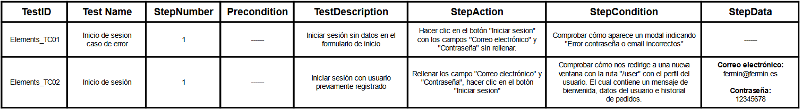

# SPRINT 4

---
## React  Node MongoDB

  
  
  

 

# :mag: Analisis del problema.
---

>En esta tarea, nos enfocaremos en el desarrollo del componente 'ShoppingCart', el cual permitirá al usuario, previamente logueado, seleccionar artículos y añadirlos al carrito. Una vez que los artículos estén agregados y sean visibles en la cesta, será posible modificar tanto las cantidades como eliminar los artículos del carrito.
El componente 'ShoppingCart', además de mostrar los artículos, también exhibirá el valor total de la compra, los datos del cliente para el envío y la opción de seleccionar un método de pago. Una vez que se haya completado el pedido, el carrito quedará vacío y se generará una orden con los detalles de la compra. Esta orden será visible desde el perfil del usuario.

 

# 九勇뀫iseño de la solucion.
---

>Para afrontar este SPRINT, he implementado el backend con Node.js y Express para facilitar la carga de artículos desde la base de datos. Asimismo, he trabajado en la manipulación de la base de datos (MongoDB) para asegurar que contenga información relevante para ser mostrada en el frontend. En cuanto al frontend, he desarrollado una interfaz dinámica con React, diseñada para ofrecer una experiencia intuitiva en la aplicación web. El objetivo principal ha sido presentar la información de manera clara y ordenada, garantizando así una experiencia de usuario óptima.

 

# 📝 Implementación de la solución.
---

>Verificaremos el funcionamiento del carrito (ShoppingCart) de la siguiente manera: estando en la ruta '/home' de nuestra web, al hacer clic en el icono del carrito, se nos indicará que debemos iniciar sesión previamente. Una vez iniciada la sesión, podremos añadir artículos al carrito. Al navegar hacia el carrito, se mostrará un mensaje indicando que no hay artículos en él si el usuario no tiene elementos en la propiedad 'cart' de la base de datos, de donde extraeremos la información para mostrarla en el carrito.
>
>Una vez que hemos cargado al menos un artículo en el carrito y navegamos hacia él, debería presentarnos los artículos previamente agregados, ofreciendo opciones para modificar la cantidad de los mismos o eliminarlos. Además, mostrará el precio total del pedido, el método de pago seleccionado y la opción para tramitar el pedido.
>
>Si intentamos tramitar el pedido sin seleccionar un método de pago, se mostrará una advertencia recordándonos que debemos elegir una opción de pago. Una vez seleccionado, al hacer clic en "Tramitar pedido", se creará una orden para el envío al cliente, y el usuario podrá visualizar el pedido realizado en su perfil.
>
>Todo este proceso será documentado en un plan de pruebas, respaldado por un video para cada prueba, permitiendo así la visualización del correcto funcionamiento del carrito.

 

# ✅Pruebas
---

#### Test Login:

#### Test Añadir articulos en el carrito: 

#### Test Modificar carrito:

#### Test Tramitar pedido:

#### Test Orden creada:

## [Descarga el plan de pruebas](./Documentacion/PlandepruebasCarrito(Fermin).pdf)